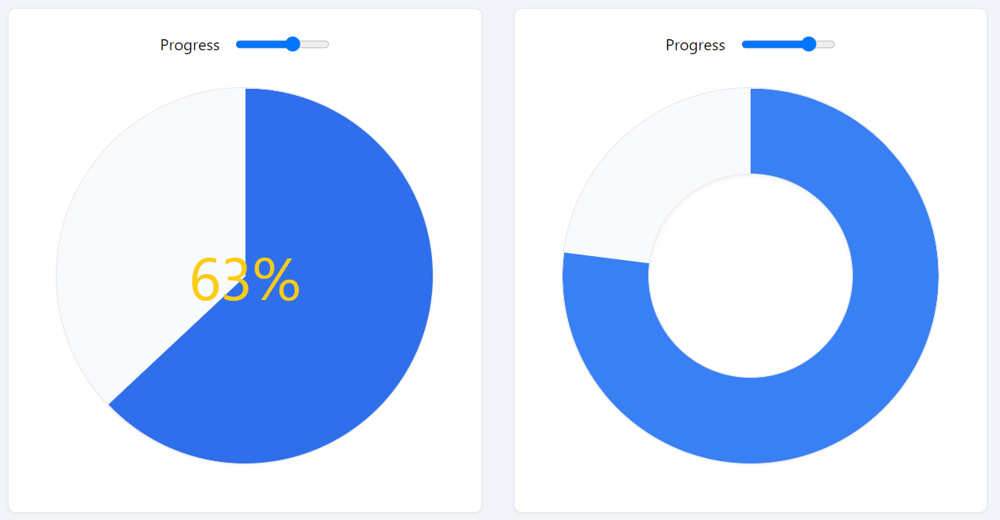

# vue3-tailwind-pie-chart
 [](https://www.npmjs.com/package/vue3-tailwind-pie-chart) 
[](LICENSE.md)
 [](https://www.npmjs.com/package/vue3-tailwind-pie-chart) 



Simple progress pie chart that works with [Tailwind CSS](https://tailwindcss.com/). 

**[Live playground (codesandbox).](https://codesandbox.io/s/github/zavalen/vue3-tailwind-pie-chart?file=/src/App.vue)**

## Installation

```bash
$ npm install -D vue3-tailwind-pie-chart
```

Register the component globally:

```js
// main.js
import { createApp } from 'vue'
import App from './App.vue'
import { ProgressChart } from 'vue3-tailwind-pie-chart'

const app = createApp(App)

app.component('ProgressChart', ProgressChart)

app.mount('#app')

```

or locally (composition API):

```vue
// YourComponent.vue
<script setup>
import { ProgressChart } from 'vue3-tailwind-pie-chart'

</script>
```

## Usage

#### Basic

```vue
    <progress-pie-chart
      class="w-96 h-96 bg-slate-50 text-blue-500"
      :progress="75"
    />
```

`w-96 h-96` - size.
`bg-slate-50` is a color of the empty space.
`text-blue-500` is a color of the progress.


### Changing color on progress hover

```vue
    <progress-pie-chart
      class="w-96 h-96 bg-slate-50"
      :progress="75"
      progress-class="text-blue-500 hover:text-blue-700  transition-colors"
    />
```

### Usage with a center slot
```vue
    <progress-pie-chart
      class="w-96 h-96 bg-slate-50 border shadow-sm"
      :progress="progress"
      progress-class="text-blue-500 hover:text-blue-700  transition-colors"
    >
      <template #center>
        <span class="text-6xl text-yellow-400">{{ progress }}% </span>
      </template>
    </progress-pie-chart>
```

### Making a hole in the pie chart
```vue
    <progress-pie-chart
      class="w-96 h-96 bg-slate-50 border shadow-sm"
      :progress="progressTwo"
      progress-class="text-blue-500 hover:text-blue-700  transition-colors"
    >
      <template #center>
        <div class="h-52 w-52 bg-white rounded-full shadow-inner border"></div>
      </template>
    </progress-pie-chart>
```

### Сounterclockwise pie chart
```vue
    <progress-pie-chart
      class="w-96 h-96 bg-slate-50 border shadow-sm"
      :progress="progressTwo"
      progress-class="text-blue-500 hover:text-blue-700  transition-colors"
      :flip="true"
    />
```
## Contributing

Any contribution to the code or any part of the documentation and any idea and/or suggestion are very welcome.

``` bash
# clone the repository
git clone git@github.com:zavalen/vue3-tailwind-pie-chart.git

# serve with hot reload at localhost:5173
npm run dev

# distribution build
npm run build

```

## License

The MIT License (MIT). 